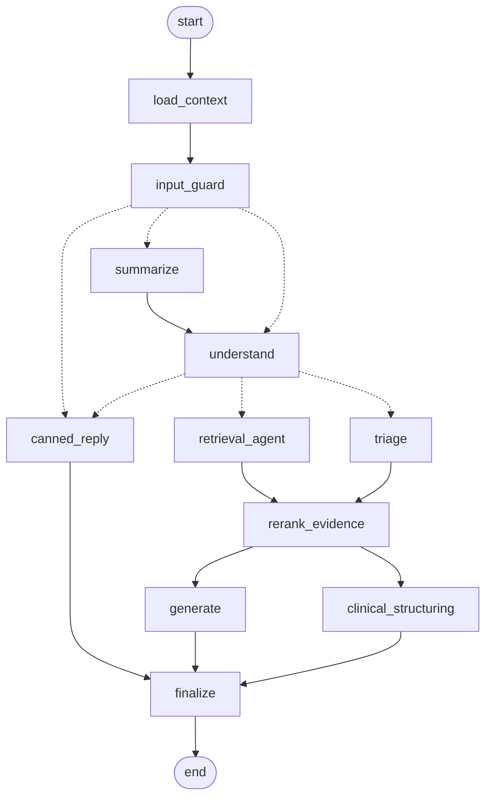

# Etheria

An India-aware AI health assistant. Etheria answers health questions, triages symptoms, explains uploaded medical reports, and checks Indian medicines for interactions. It gives triage and health information; it is not a clinician.

> **Not medical advice.** Etheria never diagnoses, never prescribes or gives doses, and never states that a drug combination is safe. In an emergency in India call **112**, or **108** for an ambulance. For mental-health support call Tele-MANAS on **14416**. The project holds synthetic data only.

## Features

- **Streamed chat** over Server-Sent Events, with citations, a triage level (GREEN / YELLOW / RED) and a trace of the steps the graph ran.
- **Symptom triage** from a deterministic rule table (India-specific lay and Hinglish terms, dengue warning signs, snake bite, heat stroke) combined with a model judgement. Rules can only raise the level. On RED the emergency block is sent before the first model token.
- **Medical report upload.** Lab reports, prescriptions, discharge summaries and imaging reports (PDF, PNG, JPEG) are parsed, PII-masked, classified, extracted into structured records, and indexed for search.
- **Indian medicine lookup.** 253,973 Indian brand names resolve to their ingredients (for example, Dolo 650 resolves to paracetamol/acetaminophen), with fuzzy matching.
- **Drug interaction checks** from the DDInter interaction graph, backed by a curated safety net of critical interactions. A missing interaction is reported as "not found, confirm with a pharmacist", never as safe.
- **Condition explorer.** Maps symptoms to India-common conditions in a curated knowledge graph.
- **Evidence retrieval** from PubMed and MedlinePlus, plus hybrid search over the user's own reports.
- **Conversation history:** rename, delete, continue a chat, and regenerate an answer.
- **Account management**, including full account erasure.

## Architecture

A modular monolith with two Python processes and Dockerised infrastructure:

| Process | Command | Runs |
|---|---|---|
| `api` | `uv run etheria api` | FastAPI plus the LangGraph chat graph, in-process, with checkpoints in Postgres |
| `worker` | `uv run etheria worker` | The Temporal worker: document ingestion for every upload, and a daily maintenance workflow on a Temporal Schedule |
| Infrastructure | `docker compose -f infra/docker-compose.yml up -d` | Postgres 16 + pgvector, Neo4j 5 Community, Redis 7, the Temporal dev server |
| Frontend | `npm run dev` | Next.js 16 / React 19 on port 3000 |

Module boundaries are enforced with import-linter. For example, nothing imports `api`, and `ingestion` never imports `graph`.

### Chat graph

A deterministic guardrail shell wraps a bounded, tool-calling retrieval agent. The diagram is generated from the compiled LangGraph `StateGraph`. Dotted arrows are conditional edges.



| Node | Role |
|---|---|
| `load_context` | Loads the user's record: report index, test catalogue, latest lab values, medications, conditions |
| `input_guard` | Applies prompt-injection heuristics; blocked input gets a fixed reply |
| `summarize` | Compresses long conversations (more than 20 messages in the window) |
| `understand` | Structured read of the question (intent, symptoms, medicines, relevant tests, red flags); routes off-topic and upload-help messages to a fixed reply |
| `retrieval_agent` | A `create_agent` loop with model-call and tool-call limits, over 8 read-only tools |
| `triage` | Combines the rule table with a model judgement; rules can only raise the level, and a failure defaults to YELLOW |
| `rerank_evidence` | Cross-encoder rerank of the gathered evidence |
| `generate` | Streams the answer through `StreamGuard`, which filters each sentence deterministically before it streams (no doses, no "safe to combine") |
| `clinical_structuring` | In parallel with `generate`: a differential (symptom questions only) and 2-4 follow-up questions; skipped for RED |
| `finalize` | Final rule pass over the whole reply, appends the disclaimer, stores the message and starts the non-blocking post-hoc audit |

**Agent tools:** `get_lab_values`, `get_current_medications`, `search_my_reports`, `search_medical_literature` (PubMed), `search_health_topics` (MedlinePlus), `explore_conditions`, `resolve_medicine` and `check_interactions`.

Design invariants:

- **User identity lives only in the trusted runtime context.** It never appears in model-visible state or tool arguments, so neither the model nor injected text can reach another user's data. Postgres row-level security backs this up.
- **The `messages` table is the system of record.** LangGraph checkpoints are execution state only (`durability="exit"`). Regenerate forks from the previous turn's checkpoint, and a pruned thread is rebuilt from `messages`.
- **Only public layers are cached:** medical API responses, query embeddings and knowledge-graph lookups. Answers and user data are never cached.
- **One model registry** (`llm/registry.py`) maps every node to a model: `deepseek-flash` (thinking disabled) for structured, tool and streamed nodes, and `deepseek-v4-pro` for the post-hoc audit.

### Document ingestion

Each upload starts an `IngestDocumentWorkflow` on Temporal. Activities are durable and resume after a worker crash:

```
validate -> parse (PyMuPDF text layer / Tesseract OCR) -> PII mask (Aadhaar, Indian phone numbers)
  -> classify -> per-type extraction -> grounding check + validation -> chunk + embed (BGE-large) -> store
```

- **The model parses and code judges.** Every extracted number must appear verbatim in the source text (the grounding check), and the abnormal flags are computed by code from the reference ranges.
- **Numeric lab values are never taken from OCR'd images.**
- **Storage rule:** fields that are queried are normalised into tables; fields that are only displayed are stored as JSONB.
- **Files are encrypted at rest** with AES-256-GCM under random storage names.
- **Uploads are validated before ingestion:** the type is read from magic bytes, with a 10 MB limit, a 30-page limit, a pixel-bomb guard, and rejection of encrypted PDFs.

### Knowledge layer

- **Neo4j:** curated India-common conditions, symptoms, drug classes and body systems; DDInter drug-drug interactions (`INTERACTS_WITH {severity, source}`); and a curated safety net of critical interactions. Conditions carry ICD-10 names and SNOMED CT codes; drugs carry RxCUIs.
- **Postgres:** Indian brand names (`medicine_brands`, trigram fuzzy match) and `drug_synonyms` (for example, paracetamol to acetaminophen).
- **Seeder** (`uv run etheria seed`): runs 8 idempotent phases. It downloads and checksum-verifies the source data, loads both stores, enriches codes from NLM, BioPortal and RxNav, and finishes with canary checks.

| Knowledge layer (seeded) | Count |
|---|---:|
| Drugs (DDInter + 22 curated) | 1,961 |
| Interaction edges (DDInter) | 160,235 |
| Critical safety-net edges | 658 |
| Conditions / symptoms | 122 / 154 |
| Indian medicine brands | 253,973 |

## Tech stack

| Layer | Technologies |
|---|---|
| Backend | Python 3.12, FastAPI, LangGraph 1.2 / LangChain 1.4, Temporal, SQLAlchemy 2 + Alembic, psycopg 3, structlog, Typer, uv |
| Models | DeepSeek (`deepseek-flash`, `deepseek-v4-pro`); BGE-large-en-v1.5 embeddings and a cross-encoder reranker (sentence-transformers, CPU-only torch) |
| Data | Postgres 16 + pgvector (row-level security, monthly partitions), Neo4j 5, Redis 7 |
| Frontend | Next.js 16, React 19, TypeScript, Tailwind CSS 4, TanStack Query, Zustand |
| External sources | PubMed (NCBI E-utilities), MedlinePlus, NLM ICD-10, BioPortal (SNOMED CT), RxNav, DDInter, Indian Medicine Dataset |

## Repository layout

```
backend/
  src/etheria/
    api/            FastAPI app, middleware, routers (chat, history, upload, user, health)
    auth/           registration, login, JWT access tokens, rotating refresh tokens
    graph/          chat graph: state, nodes/, retrieval agent, tools, service, evals
    safety/         red-flag rules, triage rules, input guard, StreamGuard, drug cautions
    ingestion/      Temporal workflow + activities: parse, mask, classify, extract, ground
    retrieval/      embeddings, hybrid search (pgvector + full text, RRF), rerank
    knowledge/      medicine resolver, interactions, condition explorer (Neo4j)
    medical_apis/   PubMed, MedlinePlus, ICD-10, BioPortal, RxNav clients
    seed/           knowledge-layer seeder and curated YAML (seed/data/)
    maintenance/    daily partitions, audit retention, checkpoint pruning
    llm/            model registry and prompt loading
    db/ cache/ core/ evals/
  prompts/          one Markdown prompt per node
  migrations/       Alembic migrations (schema, RLS, checkpoints, maintenance)
  tests/            unit, integration, security, live, evals, fixtures
frontend/           Next.js app (app/, src/components, src/lib)
infra/              docker-compose.yml and Postgres init scripts
```

## Getting started

### Prerequisites

- Docker
- Python 3.12 and [uv](https://docs.astral.sh/uv/)
- Node.js 20+
- A DeepSeek API key. NCBI and BioPortal keys are needed for seeding.
- Optional: [Tesseract](https://github.com/tesseract-ocr/tesseract), for scanned uploads.

### 1. Infrastructure

```bash
cp infra/.env.example infra/.env        # optional: override dev passwords
docker compose -f infra/docker-compose.yml up -d
```

Host ports: Postgres 5433, Redis 6380, Neo4j 7474/7687, Temporal 7233, Temporal UI 8233.

### 2. Backend

```bash
cd backend
cp .env.example .env                    # fill in API keys and generate secrets (see below)
uv sync
uv run etheria migrate                  # apply migrations as the owner role
uv run etheria seed                     # load the knowledge layer (about 4 minutes the first time)
```

Generate `JWT_SECRET` and `DATA_ENCRYPTION_KEY`:

```bash
uv run python -c "import secrets,base64;print(secrets.token_urlsafe(48));print(base64.b64encode(secrets.token_bytes(32)).decode())"
```

Run the two processes in separate terminals:

```bash
uv run etheria api                      # http://127.0.0.1:8000
uv run etheria worker                   # ingestion + daily maintenance
```

### 3. Frontend

```bash
cd frontend
cp .env.example .env.local              # NEXT_PUBLIC_API_URL=http://localhost:8000
npm install
npm run dev                             # http://localhost:3000
```

## CLI

| Command | Purpose |
|---|---|
| `uv run etheria api` | Run the API and chat graph |
| `uv run etheria worker` | Run the Temporal worker |
| `uv run etheria migrate` | Apply database migrations |
| `uv run etheria seed [--verify-only] [--skip-codes]` | Load or verify the knowledge layer |
| `uv run etheria maintain` | Run the daily maintenance jobs once |
| `uv run etheria eval --suite extraction\|retrieval\|graph` | Run an evaluation suite |
| `uv run etheria graph-diagram` | Regenerate the Mermaid diagram of the chat graph |

## API

| Method | Path | Description |
|---|---|---|
| POST | `/auth/register`, `/auth/login` | Create an account / sign in |
| POST | `/auth/refresh`, `/auth/logout` | Rotate the refresh cookie / sign out |
| GET | `/auth/me` | Current user |
| POST | `/chat/stream` | Send a message (SSE stream) |
| POST | `/chat/regenerate` | Regenerate the last answer (SSE stream) |
| GET | `/history/`, `/history/{id}` | List conversations / open one |
| PATCH, DELETE | `/history/{id}` | Rename / delete a conversation |
| POST, GET | `/upload/` | Upload a document / list documents |
| GET | `/upload/{id}/download` | Download the original file |
| DELETE | `/upload/{id}` | Delete a document |
| DELETE | `/user` | Erase the account and all of its data |
| GET | `/health`, `/health/ready` | Liveness / readiness |

## Security

- **Authentication.** Passwords are hashed with argon2id. Access tokens are short-lived HS256 JWTs. Refresh tokens are opaque, stored hashed, and held in an httpOnly cookie. They rotate on every refresh, and reusing an old one revokes the whole token family.
- **Isolation.** User data is isolated at three layers: service checks (another user's resource returns 404), tools that take the user only from the trusted runtime context, and Postgres row-level security under an app role that owns no tables.
- **Prompt injection.** Uploaded report text is datamarked, the agent's tools are read-only and user-scoped, and output rules are enforced deterministically.
- **Rate limits.** Login and registration are rate-limited, as are chat (20 per minute) and uploads (10 per hour). Agent loops and node timeouts are bounded.
- **Audit and retention.** An `audit_log` table is partitioned by month and kept for 12 months. Idle checkpoint threads are pruned after 7 days.
- **Account erasure.** `DELETE /user` removes every row, checkpoint thread and encrypted file that belongs to the user. Audit rows keep only a keyed pseudonym.

## Testing and evaluation

```bash
cd backend
uv run pytest -m "not integration"      # unit tests, no Docker needed
uv run pytest                           # everything (needs the Docker infrastructure)
uv run pytest tests/live --live         # real external APIs (opt-in)
uv run ruff check . && uv run lint-imports

cd frontend
npx tsc --noEmit && npx eslint && npx next build
```

The test suite covers unit, integration and security tests: forged tokens, row-level security, an injection corpus, and seeded upload fuzzing. Three evaluation suites run against real models:

| Suite | Measures | Latest result |
|---|---|---|
| Extraction | Lab-row recall against fixture ground truth, grounding, PII masking, an injected report | 54 / 54 lab rows; 0 ungrounded values |
| Retrieval (no LLM) | Hit@k, Recall@k, Precision@k and MRR for dense, keyword, hybrid and reranked search | Hybrid + rerank: Hit@3 100%, MRR 0.94 |
| Graph | 26 scenarios (14 safety, 12 quality), 15 held-out injection attacks, faithfulness and latency | Safety 14/14, quality 12/12, injection 15/15, 87% of claims supported, time to first token p50 4.3 s |

The test fixtures are synthetic medical reports, generated by `backend/tests/fixtures/reports/generate.py`.

## Known limitations

- Scanned uploads fail with `ocr_unavailable` until Tesseract is installed.
- Logout does not revoke the access token, which stays valid until it expires (at most 15 minutes).
- The `input_guard` regex heuristics are only a first filter (they blocked 2 of 15 held-out attacks). The controls behind them are what hold.
- `StreamGuard` can miss a dose phrase that is split across a forced cut in a long streamed segment.
- Two browser tabs refreshing at the same moment can sign one of them out, because the second refresh counts as token reuse.
- DeepSeek's API servers are outside India. Only masked, synthetic data is sent to them.

## Data and licences

DDInter publishes no licence, so its files are never committed or redistributed. The seeder downloads them into `backend/data/` (gitignored) and verifies their checksums. The Indian Medicine Dataset is MIT-licensed. The curated knowledge-graph YAML (conditions, symptoms, drug classes, critical interactions) carries an https source URL on every entry, checked by the seeder.
