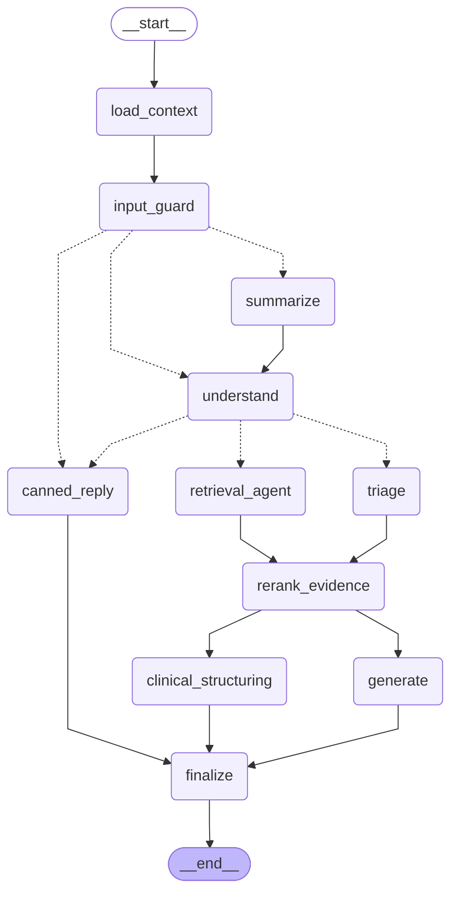

# Architecture

This file is maintained with the code. The chat-graph diagram below is generated
from the compiled LangGraph `StateGraph` by `uv run etheria graph-diagram`
(spec 1.2 criterion 3); dotted arrows are conditional edges. The design and the
reasons behind it are in `docs/superpowers/specs/2026-09-28-etheria-v2-design.md`.

## Chat graph

<!-- chat-graph:start (generated by `uv run etheria graph-diagram`; do not edit) -->

<!-- chat-graph:end -->