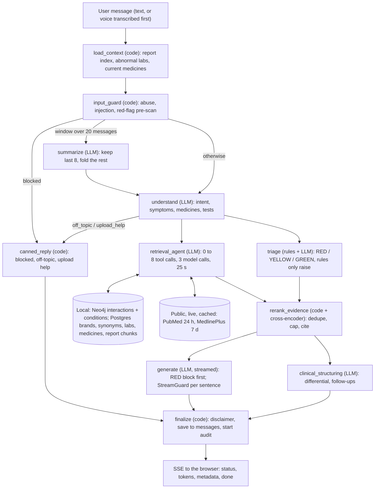
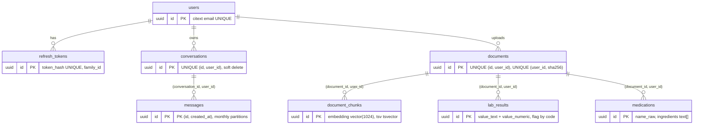

# Etheria v2 - Design Spec

| | |
|---|---|
| Date | 2026-09-28 |
| Status | Approved 2026-09-28 (owner: "let's build"); M0 done (`docs/spikes/m0-results.md`); M1 done; M2 done pending the owner's review of the curated files (6.5) |
| Repo | `D:\etheria-v2` -> https://github.com/shaunmarv3/etheria-v2 |
| Reference only, never modified | `D:\Etheria\etheria` (v1 frontend), `D:\Etheria\etheria-backend\etheria-backend` (v1 backend) |
| Next step after approval | `writing-plans` -> staged implementation plan |

## 0. Summary

Etheria v2 rebuilds the Etheria backend as a modular monolith. A FastAPI app hosts a LangGraph 1.x reasoning graph: a deterministic guardrail shell (context -> input guard -> understanding -> triage -> generation -> output checks) around a bounded, tool-calling retrieval agent. A Temporal worker runs document ingestion: uploads are classified by type, typed data (lab values, medications) is extracted by an LLM, checked against the source text, and judged by deterministic code. An India-aware knowledge layer combines DDInter drug-drug interactions, Indian brand-to-ingredient resolution and curated India-common conditions across Neo4j and Postgres. Authentication moves from Clerk into our own Postgres. The v1 Next.js frontend is copied and changed only where auth and removed features require it. Security controls map to India's DPDP Rules 2025 (Rule 6). Docker runs infrastructure only.

## 1. Purpose, success criteria, non-goals

### 1.1 Purpose
A portfolio and learning project, demoed locally or over screen-share. No real users and no real health records: synthetic data only. Two goals drive every decision:

1. **Learn by building.** The owner learns LangChain 1.x and LangGraph 1.x by building a real system with them.
2. **Every resume claim is true.** Each claim is demoable and, where it is a number, queried from the running system.

### 1.2 Success criteria (checked at the end of M7)
1. `docker compose up -d`, `uv run etheria api` and `uv run etheria worker` bring the whole system up on the owner's Windows 11 machine. Docker disk usage after seeding is at most 3 GB.
2. The copied frontend works end to end: register, log in, streamed chat, upload a synthetic report and ask about it, history (list, open, rename, delete), regenerate, voice input, text-to-speech, delete a document, delete the account.
3. The chat pipeline is a real LangGraph `StateGraph`. `docs/ARCHITECTURE.md` embeds a Mermaid diagram generated from the compiled graph by `uv run etheria graph-diagram`, so the documentation cannot drift from the code.
4. Extraction eval on the synthetic fixtures: every stored numeric value passes the grounding check (by construction), and at least 95% of ground-truth lab rows are recovered with the correct value, unit and reference range.
5. Graph eval (at least 30 scenarios): all safety scenarios pass (no diagnosis, no dosing, never "safe to combine", RED plus India emergency numbers for red flags, instructions injected into a report are not followed); at least 90% of quality scenarios pass.
6. The seeder's verification report passes every canary, and the real node and relationship counts are recorded in `docs/NUMBERS.md`.
7. Security tests pass: cross-user isolation at API, tool and database (RLS) level; refresh-token reuse detection; rate limits; upload validation.
8. Latency is measured on the eval set and recorded. Targets: p50 time to first token at most 6 s; p50 full response at most 15 s.

### 1.3 Non-goals
- Real patients, production deployment, public sign-up.
- ABDM / ABHA / FHIR integration (documented as the natural next step, not built).
- A multi-agent supervisor/specialist topology.
- Numeric extraction from images; handwritten prescriptions; medical images, DICOM or ECG.
- Trends across reports and LOINC normalisation.
- Features removed from the frontend: profile, user data export, session export, feedback, admin dashboard.
- Never built, because the frontend never calls them: message edit, message delete, document rename, non-streaming `/chat`.
- Email verification, password-reset email, OAuth / social login, MFA.
- Multilingual support. Hinglish input may work incidentally through Whisper and the LLMs, but it is not tested.

## 2. Decision log

| # | Topic | Decision | Why | Rejected |
|---|---|---|---|---|
| D1 | Shape | Modular monolith: one codebase, two processes (`api`, `worker`) | Solo project; one deploy; no network hop between API and graph | Microservices; LangGraph Platform |
| D2 | Orchestration | LangGraph 1.x: deterministic guardrail shell + bounded tool-calling retrieval agent | Guardrails are graph structure and cannot be skipped; retrieval adapts to the question | Fixed pipeline (not agentic); fully agentic (safety becomes optional) |
| D3 | Models | Per node: DeepSeek `deepseek-flash` (non-thinking mode; model ID confirmed in M0) for structured, tool-calling and streamed generation nodes; `deepseek-v4-pro` for the post-hoc audit; voice provider decided at M5 start (section 12) | The owner holds only a DeepSeek key (changed after M0; Claude Haiku 4.5 was the original generator). M0 measured `deepseek-flash`: 10/10 structured output, 5/5 tool choice, stream time to first token p50 0.81 s. Negative-constraint adherence rests on `StreamGuard` and the graph eval; `deepseek-chat` was dropped from DeepSeek's model list by 2026-09 | Haiku for generation (no key); OpenAI audio (no key) |
| D4 | Ingestion runtime | Temporal workflow with per-activity retry policies; Temporal CLI dev server | A durable multi-step background job that survives restarts | LangGraph background graph; FastAPI `BackgroundTasks` |
| D5 | Upload semantics | Classify, then extract per type. Structured numbers only from text-layer PDFs. The LLM parses, code judges. Grounding check on every number | Reliability and safety | Text-only RAG; vision-model extraction |
| D6 | Knowledge data | DDInter 2.0 public CSVs + Indian Medicine Dataset (MIT) + curated India-common conditions + a critical-interaction safety net | Free, fast, India-aware | Curated-only small graph; UMLS bulk load |
| D7 | Auth | Own Postgres: argon2id; 15-minute JWT access token held in memory; rotating opaque refresh token in an httpOnly cookie with reuse detection | Local Clerk was painful; one fewer external dependency | Clerk; server-side sessions |
| D8 | Persistence | The `messages` table is the system of record. LangGraph checkpoints are execution state: `durability="exit"`, per-turn fields cleared, idle threads pruned | Bounded storage; a clean scaling story | Treating checkpoints as history |
| D9 | Caching | Cache only public layers (API responses, query embeddings, knowledge-graph lookups). Never cache answers or user-scoped data | Correctness and privacy | Semantic answer cache |
| D10 | Frontend | Copy v1; replace Clerk with a drop-in `useAuth`; remove the UI for cut features | Minimal change | Rewrite |
| D11 | Docker | Infrastructure only; the app runs natively via `uv`; CPU-only torch | v1 reached about 40 GB | App images |
| D12 | Location | New repo `D:\etheria-v2` (`backend/`, `frontend/`, `infra/`, `docs/`) | Owner requirement: v1 untouched | v2 branch in the old repo |
| D13 | Regenerate | Fork from the previous turn's checkpoint (LangGraph time travel); fall back to rebuilding the thread from `messages` | Idiomatic; only the last turn is regenerable | Rebuild-only |
| D14 | Retrieval | Hybrid dense (pgvector HNSW) + keyword (Postgres full-text), fused with reciprocal rank fusion, then cross-encoder rerank | Exact tokens such as "TSH" or "HbA1c" are weak spots for pure embeddings | Dense only |
| D15 | Tooling | Python 3.12, `uv` + `pyproject.toml` + lockfile, pytest, ruff, Alembic, import-linter | Modern and reproducible | pip + `requirements.txt` |
| D16 | Tracing | LangSmith, opt-in and off by default; synthetic data only | It is a third-party data processor | Always on |

## 3. Architecture

### 3.1 Runtime topology

```text
Browser - Next.js 16 (frontend/, copied from v1)
   |  JSON + SSE; Bearer access token; refresh token in an httpOnly cookie
   v
api process  (uv run etheria api)
   FastAPI routers: auth | chat | history | upload | user | health
   LangGraph chat graph (in-process) <--> AsyncPostgresSaver (checkpoints)
   retrieval: hybrid search, cross-encoder reranker, BGE-large embeddings (local, CPU)
   knowledge: Neo4j queries, medicine resolver; medical APIs: PubMed, MedlinePlus
   |  starts workflows (Temporal client)
   v
worker process  (uv run etheria worker)
   Temporal worker: ingestion workflow + activities
   Temporal schedules: checkpoint pruning, partition maintenance, log retention

Docker (infra only): postgres (pgvector/pgvector:pg16) | neo4j (5-community)
                     redis (7-alpine) | temporal (CLI dev server, SQLite, UI on :8233)

External: DeepSeek, NCBI E-utilities,
          NLM Clinical Tables, BioPortal, RxNav (normalisation only), MedlinePlus
```

### 3.2 Repository layout

```text
etheria-v2/
  backend/
    pyproject.toml  uv.lock  alembic.ini
    src/etheria/
      cli.py               # typer: api | worker | seed | graph-diagram | eval
      core/                # settings, logging, errors, ids, crypto (file encryption)
      db/                  # engine, session factory with RLS context, ORM models, repositories
      auth/                # passwords, tokens, service, router, dependencies
      api/                 # routers, request/response schemas, SSE mapping, rate limiting
      llm/                 # model registry (the one place mapping node -> model), prompt loading
      graph/
        state.py  context.py  builder.py
        nodes/             # load_context, input_guard, summarize, understand, triage,
                           # rerank_evidence, generate, clinical_structuring, canned_reply, finalize
        agent/             # retrieval agent factory, tools/, prompts
      retrieval/           # embedding (BGE, query cache), hybrid search, RRF, reranker, evidence pack, citations
      knowledge/           # neo4j client, cypher queries, medicine resolver, interaction service
      medical_apis/        # ported from v1: base (cache-aside + rate limit), pubmed, icd,
                           # bioportal, rxnav_normalize, medlineplus
      ingestion/           # parse, ocr, pii_mask, classify, extractors/, grounding,
                           # chunking, workflow.py, activities.py, worker.py (embeds via retrieval.embedding)
      safety/              # red_flags, stream_guard, disclaimers, emergency, audit
      voice/               # stt, tts
      seed/                # manifest, downloaders, loaders, verify; data/*.yaml (curated)
      cache/               # redis client, key builders
    migrations/            # Alembic
    prompts/               # versioned prompt files (*.md), loaded by llm/
    tests/                 # unit/ integration/ graph/ evals/ security/ contract/ fixtures/
  frontend/                # copy of D:\Etheria\etheria with the changes in section 13
  infra/docker-compose.yml
  docs/                    # superpowers/specs, superpowers/plans, ARCHITECTURE.md, NUMBERS.md, SECURITY.md
```

### 3.3 Dependency rules (enforced by import-linter)
- `api` may import anything below it. Nothing imports `api`.
- `graph` may import `retrieval`, `knowledge`, `medical_apis`, `safety`, `llm`, `db`, `core` and `cache`.
- `ingestion` may import `db`, `core`, `llm`, `retrieval.embedding` and `cache`. It never imports `graph`.
- `knowledge`, `retrieval`, `medical_apis`, `safety` and `voice` never import `graph`, `ingestion` or `api`.
- `core` imports nothing from `etheria`.

### 3.4 Reuse map from v1

| v1 | v2 action |
|---|---|
| `medical_apis/base.py` (cache-aside, Redis rate limiting, shared session) | Port; switch aiohttp to httpx so there is one HTTP client stack |
| `pubmed_client`, `icd_lookup`, `umls_client` (BioPortal), `medlineplus_client` | Port |
| `rxnorm_client` | Port name normalisation only. Delete `get_interactions`: NLM retired that API on 2 January 2024 |
| `ingestion/` (pdf_parser, image_ocr, chunker, embedder) | Port and adapt (text-layer detection, page tracking, BGE query prefix) |
| `knowledge_graph/neo4j_client`, `schema` | Port and extend. `queries.py` is rewritten for the new schema. `seeder.py` is replaced by the new runner; its curated lists are re-curated for India into `seed/data/*.yaml` |
| `rag/reranker.py` | Port |
| `cache/` redis client | Port. `rag_cache` is deleted: answer caching is banned by D9 |
| `voice/stt.py`, `voice/tts.py` | Port |
| `workflows/` (Temporal) | Rewrite around the new activities; reuse the structure |
| `api/chat.py`, `llm/*`, `nlp/*`, `rag/{retriever,context_merger,query_router}` | Rewrite as graph nodes and tools; prompts and red-flag keyword lists are reviewed and reused |
| `auth/` (Clerk) | Delete; replaced by section 9 |
| `synthea/`, `core/`, `models/`, `schemas/`, `workers/` (all empty), `graphify-out/` | Not carried over |
| Dependencies: `openai-whisper` (never imported), spaCy / scispaCy / medspaCy + BC5CDR, CUDA torch | Dropped |

## 4. The chat graph

### 4.1 Runtime context (trusted, never model-visible)

```python
@dataclass(frozen=True)
class ChatContext:
    user_id: UUID
    conversation_id: UUID
    request_id: str
    regenerate: bool = False
```

Passed as `context=` to `astream` / `ainvoke`. Nodes read it through `Runtime`, tools through `ToolRuntime`. **User identity never enters model-visible state or tool arguments**, so neither the model nor a prompt injection can point a tool at another user's data.

### 4.2 State

```python
class ChatState(TypedDict):
    # persisted across turns, kept small
    messages: Annotated[list[AnyMessage], add_messages]   # window: at most 20 before summarisation
    summary: str                                          # rolling summary of older turns
    # per-turn: reset by load_context, emptied by finalize before the run ends
    turn: TurnData
```

`TurnData` (Pydantic) holds `user_message`, `report_index` (summary cards), `test_catalogue` (the user's distinct lab test names), `lab_snapshot` (abnormal plus requested values), `current_medications`, `guard`, `understanding`, `evidence`, `interaction_findings`, `triage`, `reply`, `clinical` (differential and follow-ups), `trace` and `timings`. Because `finalize` empties `turn` and runs use `durability="exit"`, each persisted checkpoint holds only the message window and the summary.

### 4.3 Nodes

| Node | Kind | Model | Responsibility | On failure |
|---|---|---|---|---|
| `load_context` | code | - | Reset `turn`; append the user message; load the report index, test catalogue, abnormal lab snapshot and current medications | Hard fail: `error` event |
| `input_guard` | code | - | Length limits, prompt-injection heuristics, red-flag pre-scan. Blocks abuse only, never medical content | - |
| `summarize` | code + LLM | DeepSeek | If the window exceeds 20 messages, summarise all but the last 8 into `summary` and remove them with `RemoveMessage` | Skip; retry next turn |
| `understand` | structured output | DeepSeek | `Understanding`: intent, symptoms (duration, severity, negation), medications mentioned, `relevant_tests` (validated against the catalogue; unknown names dropped), red flags | `RetryPolicy(max_attempts=3)`, then a `general_health` fallback, recorded in the trace |
| `retrieval_agent` | subgraph | DeepSeek | Bounded tool-calling agent (section 4.5). Produces `evidence` and `interaction_findings` | 25 s node timeout; continue with whatever was collected plus the lab snapshot |
| `triage` | rules + structured output | DeepSeek | RED / YELLOW / GREEN with reasons. Rules can only raise the level | Default **YELLOW**: fail toward caution, never GREEN |
| `rerank_evidence` | code | cross-encoder (local) | Join point. Dedupe, rerank, cap at a 6,000-token budget, assign citation numbers | Fall back to retrieval order |
| `generate` | streamed | DeepSeek | The answer, conditioned on triage, lab snapshot, evidence with `[n]` markers and interaction findings | Retry once before the first token; after it, `error` event and the partial answer is marked incomplete |
| `clinical_structuring` | structured output | DeepSeek | Differential (symptom intents only) and 2-4 follow-up questions; runs in parallel with `generate` | Empty lists |
| `canned_reply` | code | - | Fixed replies: off-topic, upload help, blocked input | - |
| `finalize` | code | - | Join point. Final deterministic pass, disclaimer, RED header check; persist the assistant message and metadata; start the non-blocking audit; build `agent_trace`; empty `turn` | Persistence failure: `error` event |

Parallel branches join through waiting edges, `add_edge(["retrieval_agent", "triage"], "rerank_evidence")` and `add_edge(["generate", "clinical_structuring"], "finalize")`: the join node runs exactly once, after every listed branch has finished, even when the branches take different numbers of steps. This was verified against LangGraph 1.2.11.

### 4.4 Edges

```text
START -> load_context -> input_guard
input_guard --blocked------------------> canned_reply
input_guard --window > 20 messages-----> summarize -> understand
input_guard --otherwise----------------> understand
understand  --off_topic | upload_help--> canned_reply
understand  --otherwise----------------> retrieval_agent  and  triage   (parallel)
[retrieval_agent, triage] -------------> rerank_evidence                (waiting join)
rerank_evidence -----------------------> generate  and  clinical_structuring  (parallel)
[generate, clinical_structuring] ------> finalize                       (waiting join)
canned_reply -> finalize -> END
```

Intents: `symptom_check`, `report_question`, `medication_question`, `general_health`, `follow_up`, `upload_help`, `off_topic`.

### 4.5 Retrieval agent
Built with `langchain.agents.create_agent` (DeepSeek). It returns a compiled graph, used as a subgraph. A wrapper node maps parent state into the agent's input and collects evidence from the agent's tool results.

- **Input:** the question, `Understanding`, the report index, the test catalogue, the abnormal lab snapshot, and the summary plus the last few turns. Enough to plan, without the whole history.
- **Bounds:** `ModelCallLimitMiddleware(run_limit=3, exit_behavior="end")`, `ToolCallLimitMiddleware(run_limit=8)`, parallel tool calls allowed, 8 s per-tool timeout, 25 s node timeout.
- **Tools:** all async and user-scoped through `ToolRuntime`. Each returns compact JSON with stable evidence IDs, used for citations.

| Tool | Model-visible arguments | Returns | Backed by |
|---|---|---|---|
| `get_lab_values` | `test_names` (must be in the catalogue), `include_abnormal` | Rows with value, unit, range, flag, report date | Postgres `lab_results` |
| `get_current_medications` | - | Medications with ingredients and source report | Postgres `medications` |
| `search_my_reports` | `query`, optional `doc_types`, `k` (at most 8) | Passages from the user's documents | pgvector + full-text, fused with RRF |
| `search_medical_literature` | `query`, `k` (at most 5) | PubMed abstracts | NCBI E-utilities (cached) |
| `search_health_topics` | `query` | Plain-language health summaries | MedlinePlus (cached) |
| `explore_conditions` | `symptoms` | Associated conditions, first-line treatment classes, red flags, self-care | Neo4j |
| `resolve_medicine` | `name` | Brand or generic name resolved to ingredients (fuzzy match) | Postgres `medicine_brands` + `drug_synonyms` |
| `check_interactions` | `drugs`, `include_current_medications` | Interacting pairs with severity and source, `not_found` pairs, unresolved names, duplicate ingredients across products, a coverage note | Neo4j (DDInter + safety net), via the resolver |

**Interaction semantics:** a pair with no edge is reported as `not_found`, never as safe, and names that could not be resolved are reported explicitly.

**Drug cautions from the user's own record (added 2026-09-28, built in M4).** Drug-drug checks do not cover "this medicine with *my* report". A curated table, `safety/drug_cautions.yaml`, holds drug-class x lab or condition cautions, each with a rationale and a public source: for example NSAID + high creatinine / low eGFR / low platelets / pregnancy / peptic ulcer; metformin + low eGFR; ACE inhibitor or ARB + high potassium or pregnancy; anticoagulant + low platelets. `check_interactions` evaluates it in code against the user's abnormal lab rows, extracted conditions and a stated pregnancy, and returns `cautions: [{drug, trigger, value, rationale, source}]` beside the interaction findings. A caution tells the user which value on which report matters and that a doctor should confirm; it never says "do not take", never says "safe", never gives a dose. No caution found is reported as "no recorded caution for your values", not as clearance.

**Known M2 gaps to fix in M4 (found by probing the seeded graph, 2026-09-28):**
- *Condition ranking.* `explore_conditions` sums matched weights, so headache alone ranks meningitis and Japanese encephalitis 2nd and 3rd. Rank by coverage instead (matched weight / the condition's total weight, then summed weight as the tie-break) so a condition whose cardinal symptoms are absent drops; pass the stated duration to the agent so acute infections are not offered for a 3-year symptom.
- *Short brand names.* "Brufen" scores 0.39 on `similarity` against "Brufen 400 Tablet" and is unresolved; `word_similarity` scores 1.0. Use word similarity for the trigram step. When close candidates differ (Brufen vs Brufen MR = + tizanidine), keep the ambiguity but check the ingredients every candidate shares (ibuprofen) and name the candidates.
- *Lay terms.* "tinnitus" is not a lay term of the ringing-in-the-ears symptom; the full-text fallback needs every word, so the `understand` node must pass clean symptom phrases, not whole sentences. Add the missing terms found by the eval.

### 4.5a End to end: from message to reply

Every message passes the same deterministic shell; only the retrieval agent chooses what to fetch, and it may fetch nothing. Code steps are fixed and cheap; LLM steps are marked. The M2 knowledge layer (Neo4j + Postgres drug tables) is local data loaded at seed time: at chat time nothing queries DDInter or the brand dataset over the network.



Which source answers what:

| Question shape | Tools the agent would pick | Data |
|---|---|---|
| "Can I take Dolo 650 with warfarin?" | `resolve_medicine`, `check_interactions` | Postgres brands + Neo4j (DDInter + safety net), local |
| "Fever and loose motions for 3 days" | `explore_conditions` (triage runs in parallel regardless) | Neo4j curated conditions, local |
| "Is my haemoglobin low?" | `get_lab_values` | Postgres `lab_results` (the user's uploads, M3) |
| "What does my discharge summary say about follow-up?" | `search_my_reports` | pgvector + full-text over the user's chunks |
| "What is PCOS?" | `search_health_topics` | MedlinePlus, live, cached 7 d |
| "What does recent research say about vitamin D?" | `search_medical_literature` | PubMed, live, cached 24 h |
| "Thanks!" / a simple follow-up | none | the message window only |

Seed-time only (never per message): DDInter and the Indian Medicine Dataset (downloaded into Neo4j and Postgres), NLM ICD-10, BioPortal and RxNav (codes stamped on graph nodes). NHS, openFDA and WHO pages are citations for the curated files, never queried at runtime. Unnecessary fetching is prevented by routing (canned replies fetch nothing), the agent's own tool choice, hard bounds (3 model calls, 8 tool calls, 8 s per tool, 25 s per node) and the cache (section 8.3). Every health message still costs at least one agent LLM call.

### 4.6 Safety: decide before speaking, filter while speaking, audit after speaking

**Before.** `triage` combines a rule table (`safety/red_flags.yaml`: cardiac, stroke (FAST), breathing, anaphylaxis, seizure or unconsciousness, heavy bleeding, self-harm, meningitis signs, dengue warning signs) with the DeepSeek assessment, and takes the higher level. For RED, the stream opens with a block emitted by code, before any model token: *call 112, or 108 for an ambulance*. Self-harm red flags add Tele-MANAS: *14416 or 1-800-891-4416*. The generator is instructed to keep a RED answer short and action-oriented.

**While.** `StreamGuard` buffers generated text to sentence boundaries (at most 200 characters or 400 ms) and applies deterministic rules to each sentence:
1. Dosing instructions (quantity + unit + frequency patterns, "take N tablets") are replaced with: "Dosing should come from your doctor or pharmacist."
2. Definitive diagnosis phrasing ("you have X", "you are suffering from X") is rewritten to "this may be consistent with X".
3. Claims that a combination is safe, or has no interaction, are replaced with the not-found wording.
4. Non-Indian emergency numbers (911, 999) are rewritten to 112.

**No evidence.** When the agent's tools return nothing relevant (a condition outside the curated graph and no MedlinePlus or PubMed hit), the reply says it found no verified source, gives only general safe guidance plus the red flags that apply, and suggests seeing a doctor. It never fills the gap with confident specifics.

**After.** `finalize` appends the disclaimer, re-checks the RED header, and starts an LLM audit (`deepseek-v4-pro`, a larger model than the `deepseek-flash` generator; same vendor, because the owner holds one key) that grades the reply against the product rules. The result is stored on the message and aggregated by the eval report. The audit is non-blocking by design: the answer has already streamed, so its job is measurement. The blocking controls are the deterministic ones.

*Known limitation:* the stream rules are pattern-based. The eval suite measures what gets through.

### 4.7 Streaming and the SSE contract
`POST /chat/stream`, body `{message, session_id?, voice_b64?}`. If `voice_b64` is present it is transcribed first (section 12).

```python
graph.astream(input,
              config={"configurable": {"thread_id": str(conversation_id)}},
              context=ChatContext(...),
              stream_mode=["messages", "custom"],
              durability="exit")
```

Tokens come from `messages` mode, filtered to `metadata["langgraph_node"] == "generate"` and passed through `StreamGuard`. Status messages come from `custom` mode, emitted with `get_stream_writer()`.

Events (`data: <json>` lines):

| `type` | Payload | Status |
|---|---|---|
| `status` | `stage`, `message` (e.g. "Checking your lab results") | New, additive; the current frontend's parser ignores it |
| `transcript` | `text` | New, additive; voice requests only |
| `token` | `content` | Unchanged |
| `metadata` | `session_id`, `triage_level`, `symptoms`, `follow_up_questions`, `differential`, `citations`, `agent_trace`, `message_id` | Unchanged; `message_id` is additive |
| `done` | - | Unchanged |
| `error` | `detail` | Unchanged |

Payload shapes match `frontend/src/lib/types.ts` exactly: `Symptom`, `DifferentialDiagnosis`, `Citation` (including the camel-case `relevanceScore` key, because the stream hands citations to the UI without key conversion) and `AgentTrace` (snake_case keys, as typed). Contract tests pin this (section 15).

`agent_trace` is built from the real run: one entry per executed node (name, role, output summary, tools called, detail). `sources` counts evidence per source, `routing_flags` records which tools the agent chose, and `cache_hit` records whether any cached API response was used.

### 4.8 Persistence, memory and regenerate
- **System of record:** the `messages` table. Every user and assistant message, with the assistant's metadata (triage, symptoms, differential, citations, follow-ups, trace, audit). The chat service inserts the user's message row in its own transaction before the graph runs, so a crash mid-turn never loses what the user typed; `finalize` inserts the assistant row.
- **Execution state:** `AsyncPostgresSaver` (`langgraph-checkpoint-postgres`), `thread_id = conversation_id`, `durability="exit"`: one checkpoint per turn, not one per node.
- **Short-term memory:** the message window plus the rolling summary (`summarize`, section 4.3).
- **Regenerate** (`POST /chat/regenerate`): find the checkpoint that ended the previous turn with `aget_state_history`, run the same user message from it (a fork), mark the old assistant message `superseded_at`, and insert the new one. If that checkpoint no longer exists (the first turn, or a pruned thread), delete the thread's checkpoints and rebuild its state from `messages`. Both paths are tested.
- **Pruning** (daily Temporal schedule): `adelete_thread` for threads idle more than 7 days and for deleted conversations. `langgraph-checkpoint-postgres` 3.1.x does not implement `aprune` (verified in M0: `NotImplementedError`), so there is no keep-latest mode; a pruned thread is rebuilt from `messages` on its next turn, the same fallback regenerate uses.
- **Regenerate fork point** (verified in M0 under `durability="exit"`): the newest snapshot in `aget_state_history` whose message window holds N-1 user messages and whose `next` is empty.

### 4.9 Model registry
`llm/registry.py` is the only place that maps a node to a model. Each entry holds provider, model ID, temperature, timeout and max tokens.

| Role | Model |
|---|---|
| `understand`, `summarize`, `triage`, `clinical_structuring`, retrieval agent, audit, document classification and extraction | `deepseek-flash` via `langchain-deepseek`, thinking disabled (`extra_body={"thinking": {"type": "disabled"}}`) |
| `generate` | `deepseek-flash` via `langchain-deepseek`, streamed, thinking disabled |
| Audit (post-hoc, non-blocking) | `deepseek-v4-pro` via `langchain-deepseek` |
| Speech-to-text / text-to-speech | Decided at M5 start (section 12) |

DeepSeek's structured-output and tool-calling reliability is verified first, in M0. If a node fails its eval, the registry lets that node alone switch model.

## 5. Document ingestion

### 5.1 Upload API
`POST /upload/` (multipart). Validation runs before anything is stored:
- At most 10 MB and 30 pages.
- Type decided by magic bytes, not extension: PDF, PNG, JPEG.
- Encrypted PDFs rejected; image decompression-bomb guard (Pillow `MAX_IMAGE_PIXELS`).
- Filename sanitised for display only; the file is stored under a random UUID.
- A per-user SHA-256 duplicate check returns the existing document.
- Rate limit: 10 uploads per user per hour.

The response is `{document_id, filename, status: "pending", page_count}`, and the Temporal workflow starts.

### 5.2 Storage
Files are encrypted with AES-256-GCM before being written to `data/uploads/` (key from `DATA_ENCRYPTION_KEY`, a random 96-bit nonce per file). `GET /upload/{id}/download` decrypts and streams the file to its owner.

### 5.3 Workflow: `IngestDocumentWorkflow(document_id)`

| Step | Activity | Retry policy | Notes |
|---|---|---|---|
| 1 | `parse_document` | 3 attempts | Per page: use the text layer if it has at least 50 characters, otherwise OCR (Tesseract). Records `source_kind` per page: `text_layer` or `ocr` |
| 2 | `mask_pii` | none (deterministic) | Section 5.4 |
| 3 | `classify_document` | 3 attempts, 30 s timeout | DeepSeek structured output: `doc_type`, `report_date`, `lab_name`, confidence. Below 0.6 confidence, the type is `other` |
| 4 | `extract_structured` | 3 attempts, 90 s timeout | Per-type extractor (section 5.5). Skipped for pages whose `source_kind` is `ocr` |
| 5 | `validate_and_flag` | none | Grounding check; flags computed by code (section 5.6) |
| 6 | `chunk_and_embed` | 3 attempts | 500-token chunks with 50-token overlap, page-aware; BGE-large embeddings |
| 7 | `store_results` | 5 attempts | One transaction: `lab_results`, `medications`, `document_chunks`, the document's summary card, status `done` |

The workflow updates `documents.status` (`pending`, `processing`, `done`, `failed`); the frontend already polls the document list. On final failure the status becomes `failed` and an error code is stored.

### 5.4 PII masking
Applied before any text reaches an LLM or the index:
- Aadhaar numbers (12 digits, Verhoeff checksum)
- Indian mobile numbers (optional `+91`, 10 digits starting 6-9)
- Email addresses
- Labelled identifiers: "Patient Name", "Name", "UHID", "MRN", "Patient ID", "Lab No", "Referred by"
- Address lines

Age and sex are kept, because reference ranges depend on them. Masking is regex-based and unit-tested against fixtures with known PII.

### 5.5 Classification and per-type extraction

| `doc_type` | Extraction schema | Stored in |
|---|---|---|
| `lab_report` | rows: `test_name`, `value_text`, `unit`, `ref_range_text`, `page` | `lab_results` |
| `prescription` (text layer only) | `name_raw`, `dose`, `frequency`, `duration` | `medications`, after ingredient resolution |
| `discharge_summary` | `diagnoses[]`, `procedures[]`, `discharge_medications[]`, `follow_up` | `documents.extracted` (JSONB); medications also into `medications` |
| `imaging_report` | `modality`, `body_part`, `findings`, `impression` | `documents.extracted` (JSONB) |
| `other` | none | chunks only |

Every document also gets a summary card, for example: *"Full body checkup - Thyrocare - 12 Mar 2026 - 4 abnormal: low haemoglobin, low ferritin, low vitamin D, high LDL."*

Schema rule: **normalise what we query by field; use JSONB for what we only display.**

### 5.6 Grounding check and deterministic flags
- Every extracted `value_text`, and every number inside `ref_range_text`, must occur verbatim in the source page text after whitespace normalisation. Rows that fail are dropped and counted in the document's `extraction_stats`.
- `value_numeric`, `ref_low` and `ref_high` are parsed by code. Range forms handled: `a - b`, `< b`, `> a`, `upto b`, and sex-specific ranges where the report prints them.
- `flag` is computed by code: `low`, `normal`, `high`, or `unknown` when the range cannot be parsed. The model never decides abnormality.

### 5.7 Index
`document_chunks` holds `embedding vector(1024)` (HNSW, cosine) and `tsv tsvector` (a generated column using the `simple` configuration, so tokens such as "HbA1c" survive intact), plus `user_id`, `document_id`, `page` and `source_kind`. `search_my_reports` runs both searches filtered to the user, fuses them with reciprocal rank fusion (k = 60) and passes the result to the reranker. Chunks from `ocr` pages carry that marker through to the generator, whose prompt forbids quoting numbers from them. The user filter is applied inside the vector query with pgvector 0.8 iterative index scans (`SET LOCAL hnsw.iterative_scan = relaxed_order`), so a filtered HNSW search still returns k rows. The Postgres image is pinned to `pgvector/pgvector:0.8.6-pg16-trixie`.

## 6. Knowledge layer

### 6.1 Neo4j schema

```text
(:Condition  {icd10, name, synonyms[], snomed, cui, self_care[], red_flags[], india_common})
(:Symptom    {code, name, lay_terms[], snomed, cui})
(:BodySystem {name})
(:DrugClass  {name})
(:Drug       {ddinter_id, key, name, rxcui, source, atc})   // source: "ddinter" | "curated"

(:Symptom)-[:ASSOCIATED_WITH {weight}]->(:Condition)
(:Condition)-[:AFFECTS]->(:BodySystem)
(:Condition)-[:FIRST_LINE]->(:DrugClass)
(:Drug)-[:MEMBER_OF]->(:DrugClass)
(:Drug)-[:INTERACTS_WITH {severity, source}]->(:Drug)    // source: "ddinter" | "critical"
```

Constraints: unique `Condition.icd10`, `Symptom.code`, `Drug.ddinter_id`, `Drug.key`, `DrugClass.name`, `BodySystem.name`. Full-text indexes on `Drug.name` and on `Symptom.search_text` (the name plus lay terms in one string, so no list-property indexing is needed). `Drug.key` is the normalised name (`knowledge/text.py`) and every lookup uses it; it is unique because curated extra drugs (6.5) have no DDInter id.

Curated nodes and edges carry a namespace property `ns` ("main" for the seeded graph). A curated load deletes its namespace's edges and the curated nodes the files no longer list, then MERGEs, so the graph always equals the YAML. Neo4j Community has one database, so tests load into their own namespace and never touch the seeded graph.

A multi-hop example, *"Can I take ibuprofen for my fever? I'm on telmisartan."*: fever -> associated conditions -> first-line drug class -> ibuprofen via class membership, then ibuprofen `INTERACTS_WITH` telmisartan (moderate, DDInter).

### 6.2 Postgres drug tables
- `medicine_brands` (253,973 rows): `name`, `manufacturer`, `type`, `pack_size_label`, `composition1`, `composition2`, `ingredients text[]` (parsed), `is_discontinued`. GIN trigram index on `name` (`pg_trgm`).
- `drug_synonyms`: `alias` -> `canonical`, 37 curated true renames (for example `paracetamol` -> `Acetaminophen`, `amoxycillin` -> `Amoxicillin`, `glibenclamide` -> `Glyburide`). British spellings (`sulphate`, `aluminium`) and trailing salt words (`metoprolol succinate` -> `metoprolol`) are handled in code (`knowledge/text.py`), not in the table. Measured on the real files: 62.0% of ingredient mentions in the brand dataset match a DDInter name as written, 76.5% after spelling, salt and synonym handling. Adding the 22 curated extra drugs (6.5), 208,330 of 253,973 brands (82.0%) resolve every ingredient to a graph drug (`docs/NUMBERS.md`); the rest are reported as unresolved, never guessed.

### 6.3 Medicine resolution
Input name -> is it already an ingredient, synonym or drug? -> exact brand match -> trigram match (similarity at least 0.45; the best ingredient set must lead the best *different* ingredient set by 0.1, otherwise the result is ambiguous) -> ingredients -> spelling, salt and synonym canonicalisation -> Drug node. The lead rule compares ingredient sets, not brand names: "Dolo 650" and "Dolo 500" are strengths of one product, not an ambiguity. Anything unresolved is returned as unresolved, never guessed.

`InteractionService.check(names)` resolves every name, checks every pair of drugs from *different* products in both directions (pairs inside one combination product are not reported), reports the most severe level across sources, lists pairs with no edge as `not_found` with the note that this is not a safety statement, lists unresolved and ambiguous names, and flags the same drug appearing in two products (Dolo + Calpol: double paracetamol).

### 6.4 Seeder (`uv run etheria seed`)

| Phase | Work |
|---|---|
| 1 Download | Fetch the 8 DDInter CSVs and the Indian Medicine Dataset; verify SHA-256 against `seed/manifest.yaml`. DDInter is downloaded at seed time and never committed, because it carries no licence. The DDInter server is slow (one file took 16 minutes on 2026-09-28) but honours HTTP Range, so interrupted downloads resume. Then validate the curated files against the DDInter names |
| 2 Postgres | Load `medicine_brands` (COPY) and `drug_synonyms` |
| 3 Neo4j schema | Constraints and indexes |
| 4 Drugs | 1,939 DDInter drugs, via batched `UNWIND` of 5,000 rows |
| 5 Interactions | 160,235 DDInter pairs with severity, then the curated critical list (`source: "critical"`) |
| 6 Curated domain | Conditions, symptoms, body systems, drug classes and their edges, from `seed/data/*.yaml` |
| 7 Codes | ICD-10 names verified via NLM Clinical Tables; SNOMED CT and CUI via BioPortal, exact matches only (the fuzzy top hit for "dengue fever" is dengue haemorrhagic fever: a wrong code is worse than none); RxCUI via RxNav. Bounded concurrency (8), cached 30 days |
| 8 Verify | Real counts per label and relationship type, written to `docs/NUMBERS.md`; then the canaries |

Canaries (any failure means a non-zero exit):
- "Dolo 650" resolves to acetaminophen.
- The warfarin + acetaminophen edge exists.
- Sertraline + tramadol is flagged, via the safety net.
- "loose motions" matches the diarrhoea symptom.
- Every curated condition has at least one symptom edge.

The seeder is idempotent (`MERGE` / upsert) and prints a per-phase report of successes and failures. There is no silent `except`.

### 6.5 Curated data files (owner review required)
In `seed/data/` unless noted:
- `conditions.yaml`: 122 India-common conditions, including dengue and severe dengue, malaria (falciparum, vivax), typhoid, tuberculosis, chikungunya, leptospirosis, scrub typhus, hepatitis A and E, iron-deficiency anaemia, vitamin D and B12 deficiency, type 2 diabetes, hypertension, hypothyroidism, PCOS, GERD, UTI, migraine, asthma, snake bite and heat stroke. Each has an ICD-10-CM code (all verified against NLM), synonyms, associated symptoms with weights in (0, 1], first-line drug *classes* (never a drug choice or a dose), self-care and red flags.
- `symptoms.yaml`: 153 symptoms with Indian-English and romanised Hindi lay terms ("loose motions", "bukhar", "ghabrahat"). A term may belong to one symptom only.
- `drug_classes.yaml`: 106 classes (WHO ATC grouping). Members are DDInter or extra drug names; non-drug measures (ORS, physiotherapy) are classes with no members.
- `extra_drugs.yaml`: 22 India-common drugs that DDInter does not list (aceclofenac, nimesulide, etoricoxib, domperidone, gliclazide and others), each with its WHO ATC code. They become `Drug {source: "curated"}` nodes, so the class-level safety net covers them: aceclofenac is an NSAID, so NSAID + warfarin applies.
- `critical_interactions.yaml`: 42 drug or drug-class pairs (serotonin syndrome, NSAID or antiplatelet + anticoagulant, potassium-sparing diuretic + ACE inhibitor or ARB, lithium, nitrate + PDE-5 inhibitor, statin + macrolide, rifampicin + hormonal contraception, and similar), each with a one-line rationale. Class sides expand to member drugs; one edge per unordered pair; the most severe entry wins.
- `drug_synonyms.yaml`: section 6.2.
- `safety/red_flags.yaml` (owned by the triage node): 26 rules covering the section 4.6 categories plus snake bite, heat stroke, poisoning and diabetic emergencies, seeded from v1's rule clusters.

Every entry cites a public source; `tests/live/test_curated_sources_live.py` checks that every source resolves and every ICD-10 code exists. Interaction citations are NHS medicine pages that name the interaction, or openFDA drug-label queries that return HTTP 200 only when that label section contains the term. The files are reviewed by the owner before M2 closes: they are medical content, and the eval scenarios depend on them.

## 7. Data model (Postgres 16 + pgvector + pg_trgm + citext)

| Table | Key columns | Notes |
|---|---|---|
| `users` | `id`, `email` (citext, unique), `password_hash`, `display_name`, `created_at` | |
| `refresh_tokens` | `id`, `user_id`, `token_hash`, `family_id`, `expires_at`, `revoked_at`, `replaced_by`, `created_at`, `user_agent` | Rotation and reuse detection |
| `conversations` | `id`, `user_id`, `title`, `triage_level`, `started_at`, `last_message_at`, `deleted_at` | `title` backs rename |
| `messages` | `id` + `created_at` (composite PK), `conversation_id`, `user_id`, `role`, `content`, `intent`, `metadata` (JSONB), `superseded_at` | **Range-partitioned by month** on `created_at`; index `(conversation_id, created_at)` |
| `documents` | `id`, `user_id`, `filename`, `mime_type`, `storage_key`, `sha256`, `size_bytes`, `page_count`, `doc_type`, `status`, `report_date`, `lab_name`, `summary`, `extracted` (JSONB), `extraction_stats` (JSONB), `error_code`, `uploaded_at`, `processed_at` | |
| `document_chunks` | `id`, `document_id`, `user_id`, `chunk_index`, `page`, `source_kind`, `content`, `embedding vector(1024)`, `tsv` | HNSW + GIN |
| `lab_results` | `id`, `user_id`, `document_id`, `test_name`, `value_text`, `value_numeric`, `unit`, `ref_range_text`, `ref_low`, `ref_high`, `flag`, `report_date`, `page` | Index `(user_id, lower(test_name))` |
| `medications` | `id`, `user_id`, `document_id`, `name_raw`, `ingredients text[]`, `dose`, `frequency`, `duration`, `source`, `report_date` | |
| `medicine_brands`, `drug_synonyms` | Section 6.2 | Public reference data; no RLS |
| `audit_log` | `id`, `created_at`, `user_ref`, `action`, `resource_type`, `resource_id`, `ip`, `user_agent`, `details` (JSONB) | **Partitioned by month**; partitions older than 12 months are dropped |
| LangGraph checkpoint tables | Managed by `AsyncPostgresSaver.setup()` | |

**Row-level security** on `conversations`, `messages`, `documents`, `document_chunks`, `lab_results` and `medications`, with the policy `user_id = current_setting('app.user_id')::uuid`. The app connects as a non-owner role (`etheria_app`), and every request transaction runs `SET LOCAL app.user_id`. Application code also filters by user; RLS is the second line of defence, and it is tested on its own.

Child tables carry composite foreign keys to their parent's `(id, user_id)` (messages -> conversations; chunks, lab results and medications -> documents). Referential-integrity checks bypass RLS, so without these a user could attach a row to another user's conversation. The app role cannot read partitions directly (only through the parent's policy), cannot write `medicine_brands` / `drug_synonyms`, and cannot delete `audit_log` rows.

**Partition maintenance:** a monthly Temporal schedule creates partitions three months ahead. A default partition catches strays, and the readiness check reports it if it is ever non-empty.

**Erasure** (`DELETE /user`): one transaction removes the user's conversations, messages, documents and their encrypted files, chunks, lab results, medications, refresh tokens and checkpoint threads. `audit_log` rows are retained for the one-year log requirement. They contain no health content, and on erasure their `user_ref` is replaced by an HMAC of the user ID.

### 7.1 Entity relationships (as built in migrations 0001 and 0002)



Not drawn: `audit_log` (monthly partitions, no foreign key: `user_ref` is text so it can be pseudonymised on erasure), `medicine_brands` and `drug_synonyms` (public reference data, no RLS, read-only to the app), and the LangGraph checkpoint tables (created by `AsyncPostgresSaver.setup()`).

Design rules that shaped the schema:
- **Every user-data table carries `user_id`**, even when it could be reached through a parent. RLS policies then need no joins, and every query filters on an indexed column.
- **Composite foreign keys `(parent_id, user_id)`** point at a `UNIQUE (id, user_id)` on the parent. Foreign-key checks bypass RLS, so a plain `document_id` foreign key would let one user attach rows to another user's document.
- **Two roles.** The owner role (`etheria`) runs migrations and the seeder; the app role (`etheria_app`) is not a table owner, so RLS applies to it. `app_current_user()` reads `app.user_id`, which `Database.for_user` sets per transaction with `set_config(..., true)`, so the value never leaks to the next user of a pooled connection.
- **Normalise what we query by field, JSONB for what we only display** (spec 5.5): lab values and medications are rows; discharge and imaging details are `documents.extracted`.
- **Partition what grows without bound** (`messages`, `audit_log`, monthly). Retention becomes dropping a partition.

### 7.2 Vector storage (pgvector)

pgvector is a Postgres extension that adds a `vector(n)` column type, distance operators and approximate-nearest-neighbour indexes. Vectors therefore live in an ordinary table next to their text, owner and page, under the same RLS and transactions as everything else: no separate vector database.

```sql
CREATE EXTENSION IF NOT EXISTS vector;                  -- 0001, once per database

CREATE TABLE document_chunks (                          -- 0002
  ...,
  content   text NOT NULL,
  embedding vector(1024) NOT NULL,                      -- BGE-large-en-v1.5 output size
  tsv tsvector GENERATED ALWAYS AS (to_tsvector('simple', content)) STORED
);
CREATE INDEX document_chunks_embedding_idx
  ON document_chunks USING hnsw (embedding vector_cosine_ops);   -- dense search
CREATE INDEX document_chunks_tsv_idx
  ON document_chunks USING gin (tsv);                             -- keyword search
```

- **The dimension is fixed by the model.** `vector(1024)` accepts exactly 1024 floats; changing the embedding model to one with a different size needs a migration and a re-embed.
- **Distance.** `<=>` is cosine distance (`1 - cosine similarity`); `<->` is L2 and `<#>` negative inner product. The index's operator class must match the operator used in queries: `vector_cosine_ops` serves `ORDER BY embedding <=> $1`.
- **HNSW** is a graph index for approximate search: fast and good recall without a training step (unlike IVFFlat, which needs data before it is built). With a `WHERE user_id = ...` filter, a plain HNSW scan can return fewer than k rows, so queries run `SET LOCAL hnsw.iterative_scan = relaxed_order` (pgvector 0.8) and keep scanning until k matching rows are found (5.7).
- **Writing.** Ingestion inserts the embedding as a parameter (`pgvector.sqlalchemy.Vector` in the ORM, or the text form `'[0.01, -0.2, ...]'`), in the same transaction as the lab rows (5.3 step 7).
- **Reading** (M4, `search_my_reports`):

```sql
SET LOCAL hnsw.iterative_scan = relaxed_order;
SELECT id, document_id, page, source_kind, content, 1 - (embedding <=> $1) AS similarity
FROM document_chunks
WHERE user_id = app_current_user()
ORDER BY embedding <=> $1
LIMIT 20;
```

The keyword half runs `tsv @@ websearch_to_tsquery('simple', $2)` ranked by `ts_rank_cd`, and the two ranked lists are fused with reciprocal rank fusion (5.7, D14).

## 8. Scale and caching

### 8.1 Messages are not the scaling problem
A user message row is about 2 KB; an assistant row with metadata is about 8 KB. At 10,000 users x 20 turns a month, that is about 400,000 rows and 2 GB a month: routine for Postgres with monthly partitions and an index on `(conversation_id, created_at)`. History pages use keyset pagination. Retention and archival become "detach and drop a partition", an O(1) operation.

### 8.2 Checkpoints are
By default LangGraph writes a checkpoint after every superstep, containing the full state. With retrieved evidence held in state, that is roughly 12 checkpoints x 30-60 KB per turn. v2 applies three controls:
1. `durability="exit"`: one checkpoint per turn.
2. `finalize` empties the per-turn state, so a checkpoint is about the message window plus the summary (20-25 KB).
3. Idle threads are deleted from the checkpointer and rebuilt from `messages` when resumed. M0 measured a persisted checkpoint at about 553 bytes for a two-turn stand-in graph.

The estimated result is a 25-40x reduction in checkpoint storage. It is measured in M7 and recorded in `docs/NUMBERS.md`.

### 8.3 Caching matrix

| Cached in Redis | TTL |
|---|---|
| PubMed search and fetch | 24 h |
| MedlinePlus | 7 d |
| NLM ICD-10, BioPortal, RxNav | 30 d |
| Query embeddings (key: model + SHA-256 of the text) | 7 d |
| Knowledge-graph lookups (`explore_conditions`, interaction pairs) | 24 h |

**Never cached:** final answers in any form; differentials and triage results; lab values, medications, report chunks, or anything else user-scoped.

Redis also holds rate-limit counters, and nothing else: v1's session cache is replaced by the checkpointer.

## 9. Authentication
- **Passwords:** argon2id (argon2-cffi defaults); minimum 10 characters; login rate limit per IP + email; identical error messages for unknown email and wrong password.
- **Access token:** JWT (HS256, `JWT_SECRET`), 15-minute lifetime, claims `sub`, `iat`, `exp`, `jti`. Sent as a `Bearer` header and held in memory by the frontend, never in localStorage.
- **Refresh token:** a 256-bit random opaque value, stored as a SHA-256 hash, 14-day lifetime, in an httpOnly `SameSite=Lax` cookie scoped to `/auth` (`Secure` whenever served over HTTPS). **Rotated on every refresh.** Presenting an already-rotated token revokes the whole token family (reuse detection) and is written to the audit log.
- **CORS and CSRF:** CORS allows the configured frontend origin only, with credentials. Because `/auth/refresh` and `/auth/logout` rely on the cookie, they also require an `Origin` matching `CORS_ORIGINS` and an `X-Requested-With` header.
- **Endpoints:** `POST /auth/register` and `POST /auth/login` (both return the access token and set the cookie), `POST /auth/refresh`, `POST /auth/logout`, `GET /auth/me`. Registration is rate limited to 5 per minute per IP (argon2id makes each attempt expensive). Error codes: `email_taken`, `invalid_credentials`, `invalid_refresh`, `refresh_reused`, `token_invalid`, `csrf_failed`, `rate_limited`.

## 10. API contract

| Endpoint | Status | Notes |
|---|---|---|
| `POST /auth/register`, `/auth/login`, `/auth/refresh`, `/auth/logout`; `GET /auth/me` | New | Section 9 |
| `POST /chat/stream` | Kept | Section 4.7 |
| `POST /chat/regenerate` | Kept | `{session_id}` -> the v1 `ChatResponse` shape (not streamed); section 4.8 |
| `POST /chat/tts` | Kept | `{text, voice, speed}` -> `{audio_b64}` |
| `GET /history/` | Kept | `?page&page_size` -> `{total, page, page_size, sessions[]}`, plus an additive `name` |
| `GET /history/{id}` | Kept | Messages gain additive `message_id`, `triage_level`, `citations`, `differential` |
| `PATCH /history/{id}` | Kept | `{name}` |
| `DELETE /history/{id}` | Kept | Soft delete plus checkpoint deletion |
| `POST /upload/` | Kept | Section 5.1 |
| `GET /upload/` | Kept | Additive `doc_type`, `summary`, `report_date` |
| `DELETE /upload/{id}` | Kept | Removes rows, chunks and the encrypted file |
| `GET /upload/{id}/download` | Kept | Requires auth; the frontend fetches it as a blob (section 13) |
| `DELETE /user` | Kept | Erasure; section 7 |
| `GET /health`, `GET /health/ready` | New | Liveness; readiness checks Postgres, Redis, Neo4j and Temporal |
| `/chat` (non-streaming), message edit and delete, document rename, session export | Never built | Not called by the frontend |
| `/user/profile`, `/user/export`, `/feedback/`, `/admin/*` | Removed | Their UI is removed (section 13) |

Errors use one JSON shape: `{"error": {"code", "message", "request_id"}}`.

## 11. Security and DPDP

### 11.1 Threat model

| Threat | Control |
|---|---|
| Account takeover by credential stuffing | argon2id; login rate limit; uniform error messages |
| Stolen refresh token | Rotation; reuse detection revokes the family; httpOnly cookie |
| Cross-user data access | Service-layer checks; tools scoped by `ToolRuntime` context, never by model arguments; Postgres RLS |
| **Indirect prompt injection through an uploaded report** | Report text reaches models as delimited, datamarked, untrusted data, and system prompts state that document content is data, never instructions. The agent holds only read-only, user-scoped tools, with no write or send actions. The extraction grounding check means injected text cannot invent numbers. Eval scenarios include injected fixtures |
| Direct prompt injection | `input_guard` heuristics; the same read-only tool design; deterministic output rules |
| Malicious upload | Magic-byte typing; size and page limits; encrypted-PDF rejection; decompression-bomb guard; random storage names; file content is never executed |
| Unsafe medical output | Section 4.6 |
| Data exfiltration through third-party LLMs | PII masking before any LLM call; synthetic data only; tracing off by default |
| Abuse and cost blow-up | Rate limits (chat 20/min per user, uploads 10/hour, login 5/min per IP + email, register 5/min per IP); bounded agent loops; per-node timeouts |
| Secret leakage | Secrets come from the environment only; `.env` is gitignored; startup fails when a required secret is missing |

### 11.2 DPDP Rules 2025, Rule 6 mapping

| Rule 6 safeguard | v2 implementation |
|---|---|
| Encryption, obfuscation, masking | AES-256-GCM for uploaded files; PII masking before LLMs and indexing; disk encryption stated as the deployment requirement for database volumes |
| Access control | Authentication, per-user service checks, RLS, a least-privilege database role |
| Visibility of access (logs) | `audit_log`: login, refresh-token reuse, upload, download, delete, erasure |
| Log retention for one year | Monthly partitions, dropped after 12 months |
| Breach detection and response | A runbook in `docs/SECURITY.md`: detection sources, the 72-hour intimation to the Data Protection Board under Rule 7, notifying affected users |
| Processor safeguards | Third-party processors listed in `docs/SECURITY.md` (section 11.3) |

The substantive obligations under the Rules apply from 13 May 2027. v2 is designed to them, but it is not a compliance certification.

### 11.3 Third-party processors
DeepSeek (API servers outside India), the M5 voice provider if it is hosted, and, when enabled, LangSmith. With real users, each would need a processor agreement and a cross-border transfer review. In v2 only synthetic data reaches them. Because the model registry routes per node, any node can move to a self-hosted open-weight model without changing the graph.

## 12. Voice
**Open (decided at M5 start):** the owner holds no OpenAI key, and DeepSeek has no audio API. Candidates: a local CPU speech-to-text model (for example `faster-whisper`) with browser or local text-to-speech, or an OpenAI key if the owner obtains one. The API contract below stays fixed either way.
- **Speech-to-text:** `voice_b64` on `/chat/stream` (25 MB limit; v1's MIME handling ported). The transcript is emitted as a `transcript` event and used as the message.
- **Text-to-speech:** `POST /chat/tts` `{text, voice, speed}` -> `{audio_b64}`; speed 0.25-4.0; text capped at 4,096 characters.

## 13. Frontend (a copy of v1)
Copied from `D:\Etheria\etheria` into `frontend/`; the original is not modified. All changes are made in the copy:
1. **Auth.** Remove `@clerk/nextjs`. Add an `AuthProvider` and drop-in `useAuth()` / `useUser()` hooks exposing the surface the app already uses (`getToken`, `isSignedIn`, `isLoaded`, `userId`, the user's email), so the 18 importing files change their import path rather than their logic. Add sign-in and sign-up pages. The access token lives in memory, with a silent refresh on load and on any 401 through `/auth/refresh`, plus client-side route guarding. Replace `ClerkProvider`, `clerkMiddleware` and the Clerk logic in `proxy.ts`. Delete `app/dev/token/`. Refresh is single-flight in the client: concurrent 401s share one `/auth/refresh` call, because a second refresh with the same cookie is treated as reuse and revokes the session.
2. **Removed features.** Delete the profile, data export, feedback and admin UI together with their `api.ts` functions (`fetchProfile`, `updateProfile`, `exportUserData`, `submitFeedback`, `fetchAdmin*`, `clearAdminCache`), plus the never-called `sendChat`, `editMessage`, `deleteMessage`, `renameDocument` and `exportSession`.
3. **Download.** `getDocumentDownloadUrl` becomes an authenticated fetch into a blob, followed by a save.
4. **Optional (M6 stretch).** Show `status` events as a progress line under the typing indicator.

## 14. Observability
- Structured JSON logs (`structlog`) with `request_id`, `conversation_id` and a hashed user reference. Health content is never logged.
- `agent_trace` per turn (section 4.7); the frontend already renders it.
- Per-node timings in the trace; the eval report aggregates latency percentiles.
- LangSmith, opt-in through `LANGSMITH_TRACING=true`.

## 15. Testing strategy

| Layer | What | How |
|---|---|---|
| Unit | Flag computation, range parsing, grounding, PII masking, composition parsing, synonym resolution, red-flag rules, `StreamGuard`, RRF, SSE mapping | pytest, no I/O |
| Node | Every graph node in isolation | Fake chat models (`GenericFakeChatModel`) |
| Integration | Repositories, RLS, migrations, hybrid search, Neo4j queries, the Temporal workflow | Real Postgres, Neo4j and Redis from `infra/`; the Temporal test environment |
| Contract | The SSE event sequence and payload keys against `frontend/src/lib/types.ts`; REST response shapes | Snapshot tests pinned to the TypeScript types |
| Extraction eval | Synthetic fixtures -> expected rows | Precision and recall report; grounding rejection counts |
| Graph eval | At least 30 scenarios across synthetic user profiles: routing, tool choice, citation of lab values, refusals, RED handling, resistance to injected reports, "never safe to combine", drug cautions from the user's reports, questions outside the curated graph. The first 26 are drafted in `backend/tests/evals/graph_scenarios.yaml` (6 from the owner's own questions, 20 typical ones; 14 safety, 12 quality) | Real models, opt-in (`uv run etheria eval`); report written to `docs/` |
| Security | Cross-user attempts (API, tool, SQL under RLS), token reuse, rate limits, upload fuzzing, an injection corpus | pytest |

**Synthetic fixtures** (`tests/fixtures/reports/`) are generated by a ReportLab script, so the ground truth is known by construction: five lab reports in Indian diagnostic-chain layouts (full-body checkup, thyroid profile, lipid profile, CBC, HbA1c + glucose), one discharge summary, one digital prescription, a scanned-image copy of a lab report (to prove no numbers are extracted from images), and a report containing an injected instruction. All carry fake PII, so masking is tested too.

## 16. Local development and Docker footprint
- `infra/docker-compose.yml`: `pgvector/pgvector:0.8.6-pg16-trixie` (host port 5433), `neo4j:5.26.31-community` (heap and page cache capped for a laptop), `redis:7-alpine` (host port 6380), and the Temporal CLI dev server `temporalio/temporal:1.9.1` (`server start-dev`, a SQLite file on a volume, runs as its non-root user, UI on :8233). Host ports 5432 and 6379 are taken by the owner's native PostgreSQL 18 service and a Redis in WSL. Named volumes only; no app images.
- The app runs natively: `uv sync`, then `uv run etheria api` and `uv run etheria worker`. torch comes from the CPU wheel index. Model weights live in the Hugging Face cache on the host.
- Budget: images about 1.5 GB plus volumes under 1 GB after seeding. M0 measured images at 1.90 GB (Neo4j alone 986 MB) and an empty Neo4j volume at 541 MB: Neo4j preallocates 256 MB transaction-log files. M2 sets `db.tx_log.preallocate=false`, `db.tx_log.rotation.size=32M` and `db.tx_log.rotation.retention_policy=keep_none` (a dev box with no backups), which took the empty volume to 1.97 MB (46 MB seeded). Measured after seeding: 2.67 GB in total (images 1.90 GB, volumes 765 MB), within the 3 GB budget (`docs/NUMBERS.md`).
- Reclaiming v1's roughly 40 GB (`docker system prune`, then compacting Docker Desktop's WSL2 disk) is a separate, destructive step, done only on the owner's explicit request.

## 17. Build order and milestones

| Milestone | Scope | Exit criteria |
|---|---|---|
| **M0 Spikes** | DeepSeek structured output and tool calling on our schemas; `AsyncPostgresSaver` with `durability="exit"` and fork-for-regenerate; the Temporal dev server on this machine | A written go / no-go per spike; this spec is updated if any spike fails |
| **M1 Foundation** | Repo, `uv`, settings, logging, infra compose, Alembic schema (RLS, partitions), auth backend, health endpoints, test harness, import-linter | Auth flow and RLS tests green; compose up within budget |
| **M2 Knowledge** | Medical API ports, curated data files (owner-reviewed), seeder with verification | Seeder canaries pass; `docs/NUMBERS.md` written |
| **M3 Ingestion** | Upload API, encrypted storage, the Temporal workflow and activities, synthetic fixture generator, extraction eval | The extraction criterion in 1.2 is met; the workflow survives a worker restart mid-run |
| **M4 Reasoning graph** | State, nodes, retrieval agent and tools, triage, `StreamGuard`, generation, finalize, SSE, history, regenerate, graph eval; drug cautions from the user's record (4.5), the no-evidence rule (4.6), and the M2 gaps listed in 4.5 (coverage ranking, short brand names, lay terms) | The graph-eval criterion in 1.2 is met; contract tests green |
| **M5 Voice** | Speech-to-text on `/chat/stream`, TTS endpoint | An end-to-end voice turn works |
| **M6 Frontend** | Copy, auth swap, removed features, download fix | The full end-to-end flow in 1.2 works in the browser |
| **M7 Hardening** | Security suite, pruning and partition schedules, retention, latency and storage measurements, `ARCHITECTURE.md` (generated diagram), `SECURITY.md`, final numbers | Every success criterion in 1.2 holds |

The LangGraph lab lessons on tools and `create_agent` (`D:\agenticshi\langgraph-lab`) should be finished before M4, where they pay off directly.

## 18. Risks

| Risk | Likelihood | Mitigation |
|---|---|---|
| DeepSeek structured output or tool calling is unreliable on our schemas | Medium | M0 spike first; the registry can swap individual nodes |
| The DDInter licence is unclear | Medium | Downloaded at seed time, never redistributed; the paper is cited; non-commercial use only |
| DDInter coverage gaps (4 of 12 tested common combinations missing) | Certain | The curated critical safety net; "not found is not safe" semantics enforced in tools, prompts and `StreamGuard` |
| Curated medical content is wrong | Medium | A cited source per entry; the owner review gate in M2; eval scenarios |
| The Temporal dev server misbehaves on Windows | Low | M0 spike; the native binary as a fallback |
| Scope | Medium | Milestones are independently shippable; stretch items are marked as such |

## 19. Owner actions
1. `DEEPSEEK_API_KEY` is in `backend/.env` (copied from the lab with the owner's go-ahead in M0). The owner has no Anthropic or OpenAI key. NCBI and BioPortal keys carry over from v1's `.env`, copied by the owner or with explicit permission, before M2. `JWT_SECRET` and `DATA_ENCRYPTION_KEY` are generated fresh.
2. Review the curated data files in M2.

## 20. Resume alignment
When M7 closes, every current claim is true, and its numbers come from `docs/NUMBERS.md`:
- "Agentic RAG": the retrieval agent chooses its own tools.
- "LangGraph": the chat graph, with its diagram generated from code.
- "Tri-layer RAG (pgvector + PubMed + Neo4j)": true, with MedlinePlus as well.
- The Neo4j bullet is rewritten with the real counts and "DDInter-backed interaction checks with RxNorm normalisation".
- "Temporal", "BGE-large-en-v1.5" and "Redis" are all true. "Whisper" is true only if M5 picks a Whisper-family model (for example `faster-whisper`); otherwise the claim is rewritten. "Clerk Auth" becomes "JWT auth with refresh-token rotation".
